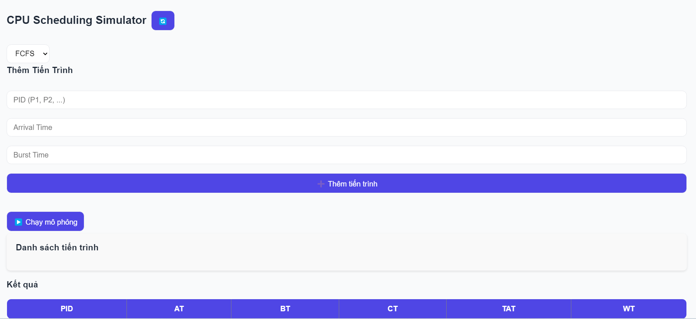

# 🖥️ Giao Diện Người Dùng - Hệ Điều Hành

Đây là phần **giao diện người dùng (frontend)** của một hệ thống mô phỏng hoặc quản lý liên quan đến Hệ Điều Hành.
Dự án được xây dựng bằng thư viện **React**, sử dụng các biểu đồ để hiển thị dữ liệu một cách trực quan, giúp người dùng dễ dàng quan sát và phân tích thông tin.

---

## 🚀 Công Nghệ Sử Dụng

* [**React**](https://reactjs.org/) – Thư viện xây dựng giao diện người dùng hiện đại, hiệu quả
* [**react-chartjs-2**](https://github.com/reactchartjs/react-chartjs-2) – Thư viện kết hợp React với Chart.js để hiển thị biểu đồ
* [**Chart.js**](https://www.chartjs.org/) – Thư viện JavaScript tạo biểu đồ đa dạng, dễ sử dụng
* [**React Scripts**](https://www.npmjs.com/package/react-scripts) – Công cụ hỗ trợ cấu hình và chạy dự án React
* **Node.js** – Môi trường thực thi JavaScript phía máy chủ và quản lý các gói npm

---

## 📦 Hướng Dẫn Cài Đặt Và Chạy Dự Án

### 1. Clone dự án về máy

```bash
git clone https://github.com/thieuat7/HDH.git
```

### 2. Cài đặt các thư viện phụ thuộc

```bash
npm install
```

### 3. Khởi chạy ứng dụng

```bash
npm start
```

Mở trình duyệt và truy cập:

👉 [http://localhost:3000](http://localhost:3000)

---

## 📷 Giao Diện Minh Họa



